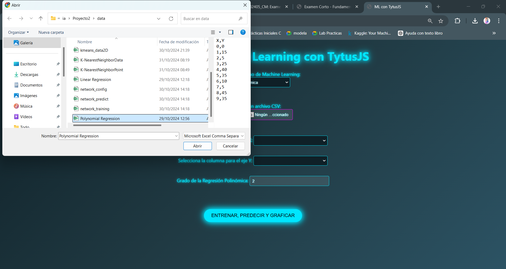
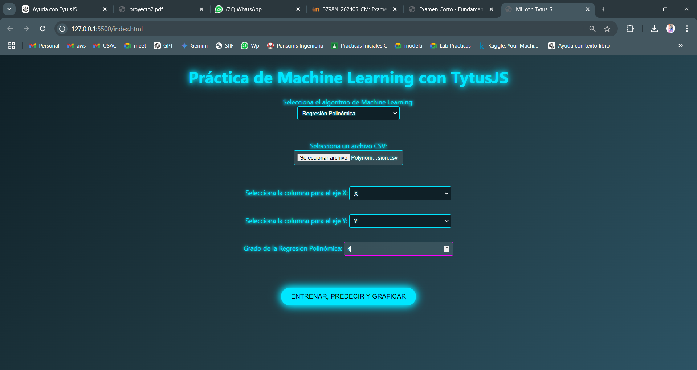

# Manual de Usuario del Proyecto de Machine Learning en TytusJS

Este manual explica el uso de la aplicación para cada algoritmo de Machine Learning disponible en TytusJS. A continuación, se detallan los pasos para el ingreso de datos, entrenamiento y visualización de resultados específicos para cada modelo.

---

## 1. Regresión Lineal

### Paso 1: Cargar Datos
- Haz clic en **Cargar CSV** y selecciona tu archivo CSV.
- Verifica que los datos aparezcan en la tabla.

### Paso 2: Selección de Columnas
- En el menú **Algoritmo**, elige **Regresión Lineal**.
- Selecciona la columna **X** (variable independiente) y **Y** (variable dependiente).

### Paso 3: Entrenamiento, Predicción y Visualización
- Haz clic en **Entrenar, Predecir y graficar**.
- La aplicación generará una **gráfica de regresión lineal** que muestra la relación entre los datos reales y los valores predichos.

---

## 2. Regresión Polinómica

### Paso 1: Cargar Datos
- Carga el archivo CSV siguiendo el mismo proceso que en la regresión lineal.

### Paso 2: Selección de Columnas y Grado del Polinomio
- Selecciona **Regresión Polinómica** en el menú **Algoritmo**.
- Selecciona las columnas **X** e **Y**.
- Especifica el **grado** del polinomio en el campo correspondiente.

### Paso 3: Entrenamiento, Predicción y Visualización
- Haz clic en **Entrenar, Predecir y graficar**.
- La aplicación generará una **gráfica polinómica** y mostrará el coeficiente \( R^2 \) para evaluar el ajuste del modelo.

---

## 3. Árbol de Decisión

### Paso 1: Cargar Datos
- Carga el archivo CSV y verifica que los datos sean visibles.

### Paso 2: Entrenamiento, Predicción y Visualización
- Haz clic en **Entrenar, Predecir y graficar**.
- La aplicación mostrará el **gráfico del árbol de decisión** visualizando cada nodo y la lógica de decisión.

---

## 4. Naive Bayes

### Paso 1: Cargar Datos
- Carga el archivo CSV en la aplicación.

### Paso 2: Selección de Columnas
- Rellena los datos necesarios solicitados por el **Algoritmo**.

### Paso 3: Entrenamiento, Predicción y Visualización
- Haz clic en **Entrenar, Predecir y graficar**.
- La aplicación mostrará la **clase predicha** y la **probabilidad** calculada para esa clase.

---

## 5. Red Neuronal

### Paso 1: Cargar Datos
- Carga el archivo CSV en la aplicación.

### Paso 2: Entrenamiento, Predicción y Visualización
- Haz clic en **Entrenar, Predecir y graficar**.
- Visualiza las **predicciones**, los **pesos** y **sesgos** de cada capa, y gráficos de barras que muestran los valores ajustados por la red.

---

## 6. K-Means

### Paso 1: Cargar Datos
- Carga el archivo CSV en la aplicación.

### Paso 2:Entrenamiento, Predicción y Visualización
- Haz clic en **Entrenar, Predecir y graficar**.
- La aplicación mostrará un **gráfico de dispersión** con los puntos de datos agrupados por color y los centroides de cada cluster.

---

## 7. K-Vecinos Más Cercanos (KNN)

### Paso 1: Cargar Datos
- Carga el archivo CSV en la aplicación.

### Paso 2: Entrenamiento, Predicción y Visualización
- Haz clic en **Entrenar, Predecir y graficar**.
- La aplicación mostrará la **clase predicha** basada en los vecinos más cercanos a los valores de entrada proporcionados.

---